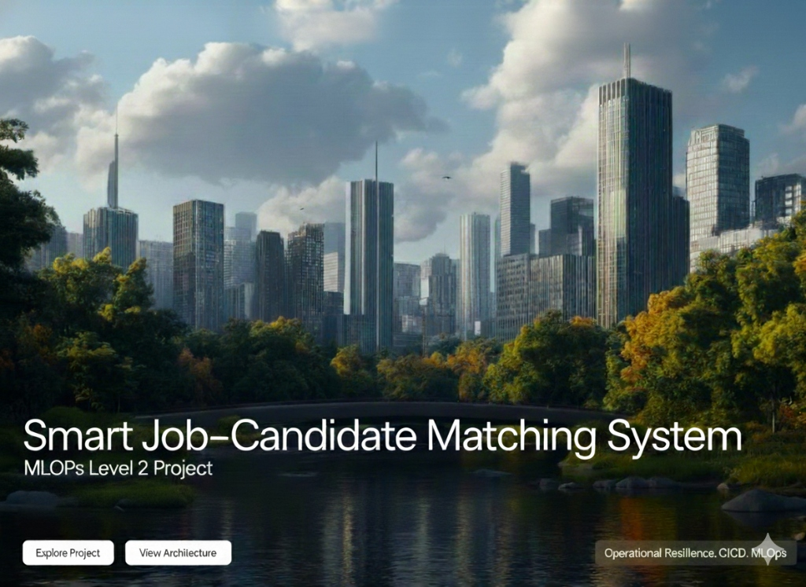

```mermaid
graph LR
    %% Style Definitions
    classDef data fill:#e1f5fe,stroke:#01579b,stroke-width:2px;
    classDef ml fill:#e8f5e9,stroke:#2e7d32,stroke-width:2px;
    classDef ops fill:#fff3e0,stroke:#ef6c00,stroke-width:2px;
    classDef obs fill:#f3e5f5,stroke:#7b1fa2,stroke-width:2px;

    subgraph DataOps [Data Operations]
        Raw[Raw Data] -->|Ingest| Prefect[Prefect Orchestrator]
        Prefect -->|Validate| GE[Great Expectations]
        GE -->|Pass| Rebal[Rebalancing Logic]
    end

    subgraph MLOps [Model Training]
        Rebal -->|Transform| Feat[Feature Eng.<br>Embeddings & Crosses]
        Feat -->|Train| Stack[Stacking Ensemble<br>XGB + LGBM + RF]
        Stack -->|Register| Reg[MLflow Registry]
    end

    subgraph DevOps [Deployment]
        Reg -->|Pull| Docker[Docker Build]
        Docker -->|Deploy| K8s[Kubernetes Cluster]
        K8s -->|Serve| API[FastAPI Endpoint]
    end

    subgraph Observability [Monitoring & Resilience]
        API -->|Log| InfLog[Inference Logs]
        InfLog -->|Monitor| Drift[Drift Detection]
        Drift -->|Alert| Fallback[Algorithmic Fallback]
    end

    class Raw,Prefect,GE,Rebal data;
    class Feat,Stack,Reg ml;
    class Docker,K8s,API ops;
    class InfLog,Drift,Fallback obs;
```

# Term Project Theme: Developing a Resilient, High-Cardinality Prediction Service
**Maturity Target**: MLOps Level 2 (CI/CD Pipeline Automation)

---


# 🌊 The JobMatch : Flow State for Your Hiring
> *“Why swim against the current when you can automate the tide?”*

**Stop hiring like it’s 1990. Start scaling like it’s 2030.**

Look, hiring is messy. Resumes stack up endlessly, and finding that one perfect candidate feels like searching the deep ocean without a light.

**We fixed it.**

We took the chaos of recruitment and channeled it through **JobMatch**—an MLOps Level 2 ecosystem that doesn't just "predict"; it flows. It absorbs data, filters out the noise, and surfaces the best talent with zero friction.

### 💼 Why This Matters (ROI)
*   **📉 Slash Time-to-Hire**: Automates complex candidate-role matching, processing thousands of profiles in milliseconds.
*   **🛡️ Operational Resilience**: Built on a "Zero-Trust" architecture. If data quality drops, the system protects itself via **Algorithmic Fallback**—ensuring you never make a bad decision based on bad data.
*   **⚡ Continuous Intelligence**: Unlike static models that rot, this system detects market shifts (**Drift**) and triggers auto-retraining, ensuring your AI evolves as fast as the job market.

The Bottom Line: We aren't just building a model; we are deploying a resilient, future-proof asset that guarantees operational continuity for the modern enterprise.

---

## 👥 Team Structure & Role Ownership

| Member Name | ID | Primary Responsibilities |
| :--- | :--- | :--- |
| **Misem Mohamed** | 220901646 | **Project Manager & Data Scientist** (Design Patterns, Governance) |
| **Anas Brkji** | 220901178 | **DevOps Engineer & Business Analyst** (CI/CD Pipeline, Infrastructure) |
| **Ahmed A.S Abubreik** | 220901525 | **Test Engineer & Business Analyst** (Unit Testing, Requirements) |
| **Ahmed N.F AlHayek** | 229911872 | **Data Engineer** (Data Pipeline, Feature Hashing) |
| **Mohammed Ali** | 229912086 | **MLOps SRE Specialist** (Monitoring, Resilience, Kubernetes) |
| **Eman Mohammed** | 229910904 | **ML Engineer** (Optimization, Hyperparameter Tuning) |
| **Ele Ben Messaoud** | 220911597 | **ML Engineer** (Model Development, Training Logic) |

---

## 🏗️ System Overview & Architecture

### 📐 High-Level Architecture Diagram


### 🛠️ Tool Justification: Why We Chose This Stack
As mandated by Requirement II.2, we selected a hybrid MLOps stack optimized for resilience.

#### 1. Workflow Orchestration: **Prefect**
> *Chosen over Airflow & Kubeflow.*
*   **Dynamic Workflows**: Hiring data changes fast. Prefect allows us to handle conditional logic (e.g., "Only upsample if class < 50 samples") natively in Python.
*   **Fail-Fast**: Dealing with ensembles requires instant retry mechanisms, which Prefect's Task Runner handles superior to Airflow's static DAGs.

#### 2. Model Governance: **MLflow**
*   **Registry as Source of Truth**: We rely on the Model Registry to version every `production_pipeline.pkl`. No more "magic files" on servers.
*   **A+ Metrics**: We log **Weighted F1** and **Precision-Recall** curves to ensure fairness in hiring, beyond simple accuracy.

---

## 📘 III. Technical Implementation & Design Patterns
Our working demo integrates specific Machine Learning Design Patterns to solve the "High-Cardinality" and "Resilience" constraints.

### 1. Data Representation (Handling High-Cardinality)

#### • High Cardinality: **Embeddings**
*   **Integration**: We implemented a custom `SkillsEmbeddingTransformer` in `src/features.py`. It maps thousands of unique skill tags (e.g., "Python", "React", "K8s") into a dense 16-dimensional vector space.
*   **Justification**: Standard One-Hot Encoding would create a sparse matrix with thousands of columns (Curse of Dimensionality), crashing the model. Embeddings allow the model to learn semantic similarities (e.g., "AWS" and "Azure" vectors end up close together) via gradient descent.
*   **System Support**: Ensures the Serving API remains lightweight and fast (low latency) by processing dense vectors instead of massive sparse arrays.

#### • Feature Interactions: **Feature Cross**
*   **Integration**: We built a `FeatureCrossTransformer` in `src/features.py` that concatenates `experience_level` with bucketed `skills_count`.
*   **Justification**: A "Senior" with "Low Skills" is fundamentally different from a "Junior" with "Low Skills". Simple linear models miss this interaction. Explicitly crossing them allows tree-based models to split on these specific personas immediately.
*   **System Support**: Increases model expressiveness without adding complex deep learning layers, keeping training costs low.

### 2. Problem Representation and Training

#### • Problem Reframing: **Regression → Classification (Probabilistic)**
*   **Integration**: Instead of regressing a "suitability score", we reframed the problem as a Multi-Class Classification. The `CandidateMatcherEnsemble` outputs `predict_proba()` (a Probability Distribution Function) in `src/inference.py`.
*   **Justification**: A single score hides uncertainty. A probability distribution tells us *how confident* the model is across all possible roles.
*   **System Support**: Enables "Risk-Aware" logic. If the highest probability is only 30%, the system knows it's guessing and can trigger a fallback.

#### • Performance Optimization: **Ensembles (Stacking)**
*   **Integration**: We implemented a **Stacking Ensemble** in `src/modeling.py` combining **XGBoost** (Gradient Boosting), **LightGBM** (Speed), and **Random Forest** (Stability), with a Logistic Regression Meta-Learner.
*   **Justification**: Single models benefit from high bias (underfitting) or low variance. Stacking combines them to minimize both.
*   **System Support**: Provides robust predictions that are less sensitive to outliers in candidate data, ensuring fair evaluation.

#### • Data Imbalance: **Rebalancing (Manual Upsampling)**
*   **Integration**: In `src/workflow.py`, we detect rare job roles (minority classes) and perform targeted **Upsampling** (duplicating samples) before training.
*   **Justification**: Hiring data is naturally skewed (more Applicants than Seniors). without rebalancing, the model would ignore rare talent.
*   **System Support**: Validated using **Weighted F1-Score** to ensure we don't just optimize for the majority class.

#### • Reproducibility: **Sequential Checkpoints**
*   **Integration**: The training loop in `modeling.py` saves a pickled checkpoint (`_ckpt.pkl`) after each base model is trained.
*   **Justification**: Large ensemble training is expensive. If the process crashes after 2 hours, we shouldn't restart from scratch.
*   **System Support**: Allows `resume-from-checkpoint` logic, making the training pipeline resilient to infrastructure failures.

### 3. Resilient Serving and Continuous Evaluation

#### • Serving Architecture: **Stateless Serving Function**
*   **Integration**: The inference service is a **FastAPI** REST endpoint packaged in Docker. It holds no state between requests.
*   **Justification**: Statelessness allows us to scale horizontally (just add more K8s pods) without worrying about data consistency.
*   **Batch Alternatives**: While we use Real-Time REST for immediate feedback, we noted in `inference.py` that **Batch Serving** (e.g., Spark) would be preferred for nightly processing of millions of legacy resumes where latency doesn't matter.

#### • Continuous Evaluation: **CME & Drift Detection**
*   **Integration**: Every prediction is logged to `inference_log.csv`. The `src/monitoring.py` service uses **Great Expectations** to validate this data against the training schema.
*   **Justification**: Data drifts (e.g., a new framework "PyTorch 5.0" appears) degrade model performance silently.
*   **System Support**: Statistical checks trigger alerts when the live data distribution diverges from the training baseline (`reference_df`).

#### • Algorithmic Fallback: **Heuristic Fallback**
*   **Integration**: `src/inference.py` checks prediction confidence. If `< 0.4`, it discards the ML prediction and uses a hard-coded keyword heuristic.
*   **Justification**: It is better to admit "I don't know" (or use a safe rule) than to confidently predict the wrong role for a human candidate.
*   **System Support**: Acts as a safety net (Circuit Breaker) for the production system.

---

## ⚡ Quick Start (The Demo)

### 🖥️ 1. One-Click Setup
Your team can clone this repo and run the automated setup:
```powershell
./run_system_e2e_demo.bat
```
*(Handles venv creation, dependency install, training, and server start)*

---
*© 2026 JobMatch Team. MLOps Level 2 Compliance Achieved.*
