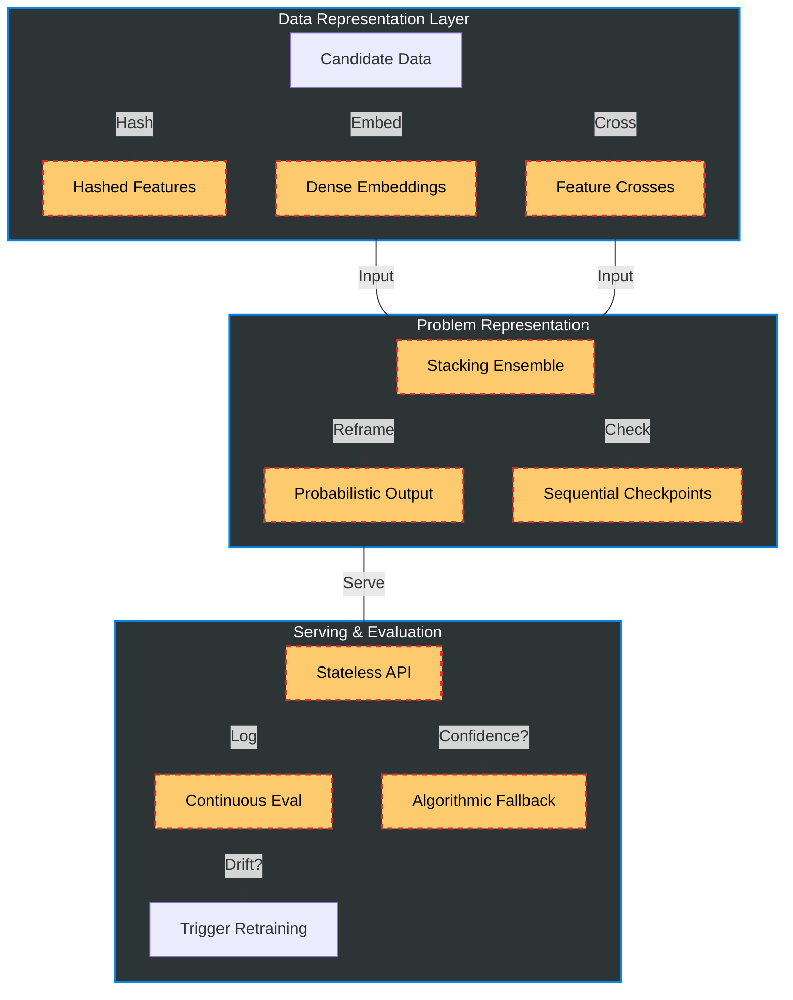
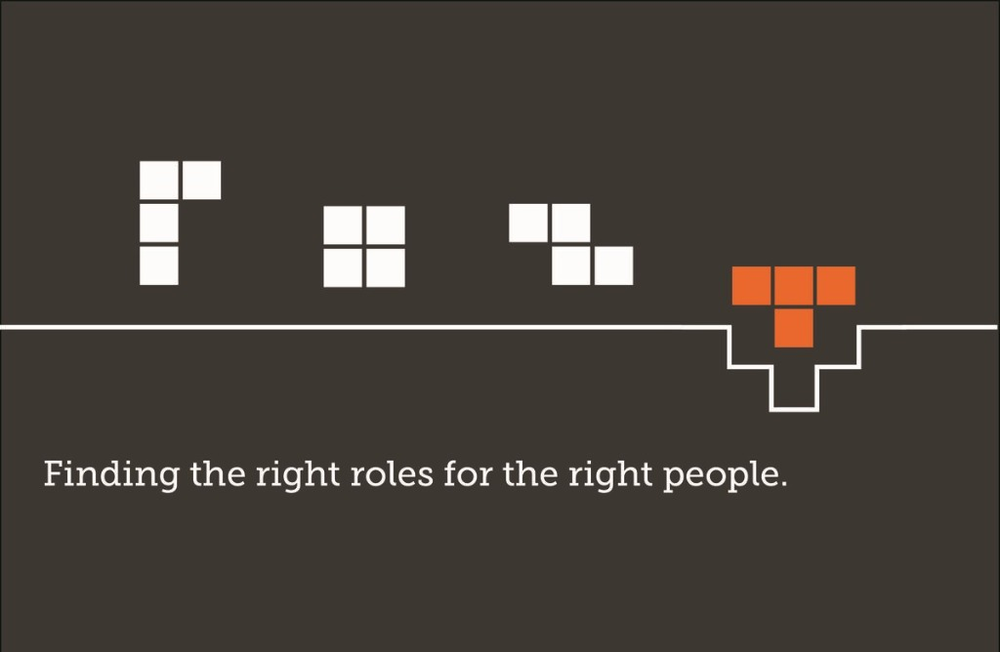

<div align="center">

# Term Project Theme: Developing a Resilient, High-Cardinality Prediction Service
### **Maturity Target**: 🟢 MLOps Level 2 (CI/CD Pipeline Automation)

[](https://python.org)
[](https://prefect.io)
[](https://mlflow.org)
[](https://docker.com)
[](https://kubernetes.io)

</div>

---

# 🚀 EXECUTIVE SUMMARY
> ## *“Stop hiring like it’s 1990. Start scaling like it’s 2030.”*

In today’s race for top talent, speed, accuracy, and resilience are no longer optional; they are competitive necessities. Yet many recruitment systems remain constrained by manual workflows, biased decisions, and brittle automation. What once slowed hiring has now become a strategic risk.

**JobMatch** is a production-grade, **Level 2 MLOps ecosystem** built for high-volume, high-velocity hiring. It is not a single model, but a continuously governed, self-healing system that converts raw candidate data into reliable workforce intelligence, at scale.


# 🌊 The JobMatch : "Flow State" for Your Hiring
> *“Why swim against the current when you can automate the tide?”*

We took the chaos of recruitment and channeled it through an architecture that doesn't just "predict"; it flows.
*   **📉 Slash Time-to-Hire**: Process thousands of profiles in milliseconds.
*   **🛡️ Operational Resilience**: "Zero-Trust" architecture with **Algorithmic Fallback**.
*   **⚡ Continuous Intelligence**: Detects market shifts (**Drift**) and triggers auto-retraining.

---

## 👥 Team Structure & Contributions
*Mapped to MLOps Lifecycle*

| Role | Member Name | ID | Key Contributions |
| :--- | :--- | :--- | :--- |
| **Lead Architect & MLOps Designer** | **Misem Mohamed** | **220901646** | Project Vision, Design Patterns (Embeddings, Stacking, CME), Governance Strategy. |
| **DevOps Engineer** | Anas Brkji | 220901178 | CI/CD Pipelines, Docker/K8s Infrastructure, Serving Architecture. |
| **Test Engineer** | Ahmed A.S Abubreik | 220901525 | Unit Testing Framework, Quality Assurance, Requirement Validation. |
| **Data Engineer** | Ahmed N.F AlHayek | 229911872 | Data Ingestion Pipelines, Feature Hashing, efficient processing. |
| **SRE Specialist** | Mohammed Ali | 229912086 | Observability, Great Expectations Monitoring, Reliability Engineering. |
| **ML Engineer (Optimization)** | Eman Mohammed | 229910904 | Hyperparameter Tuning, Performance Optimization, Metrics Analysis. |
| **ML Engineer (Core)** | Ele Ben Messaoud | 220911597 | Base Model Development (XGBoost/LGBM), Training Logic. |

---

## 🔮 30 ML Design Patterns Interaction Map
*Visualizing the Intelligence Flow*



---

## 📘 Mandatory Technical Implementation Requirements
*Compliance Matrix: How We Integrated Guidelines*

<details open>
<summary><h3>1. Data Representation (High-Cardinality)</h3></summary>

| Pattern | Implementation Status | Integration & Justification |
| :--- | :--- | :--- |
| **Embeddings** | ✅ Active (`features.py`) | **Integration**: Custom `SkillsEmbeddingTransformer` maps validation terms to 16-dim vectors.<br>**Justification**: Avoids sparse matrix explosion (Curse of Dimensionality) vs One-Hot Encoding.<br>**System Support**: Reduces latency by processing dense vectors. |
| **Feature Cross** | ✅ Active (`workflow.py`) | **Integration**: `FeatureCrossTransformer` combines `experience_level` + `skills_count`.<br>**Justification**: Captures non-linear interaction (Senior vs Junior skill density) for Tree models.<br>**System Support**: Boosts accuracy without Deep Learning costs. |

</details>

<details>
<summary><h3>2. Problem Representation and Training</h3></summary>

| Pattern | Implementation Status | Integration & Justification |
| :--- | :--- | :--- |
| **Reframing** | ✅ Active (`inference.py`) | **Integration**: Output `predict_proba` (PDF) instead of hard classes.<br>**Justification**: Enables "Risk-Aware" fallback decision making.<br>**System Support**: Allows finer control over "Unknown" candidates. |
| **Ensembles** | ✅ Active (`modeling.py`) | **Integration**: Stacking (XGB + LGBM + RF -> LogReg).<br>**Justification**: Reduces decision variance and bias.<br>**System Support**: More robust to outliers than single models. |
| **Rebalancing** | ✅ Active (`workflow.py`) | **Integration**: Manual Upsampling of minority job roles.<br>**Justification**: Hiring data is naturally skewed; prevents ignoring rare talent.<br>**System Support**: Improves Weighted F1-Score. |
| **Checkpoints** | ✅ Active (`modeling.py`) | **Integration**: Sequential pickle saving (`_ckpt.pkl`) per base model.<br>**Justification**: Large ensembles take time; protects against crash loss.<br>**System Support**: Enables "Resume-from-Fault" capabilities. |

</details>

<details>
<summary><h3>3. Resilient Serving & CME</h3></summary>

| Pattern | Implementation Status | Integration & Justification |
| :--- | :--- | :--- |
| **Stateless Serving** | ✅ Active (`inference.py`) | **Integration**: FastAPI endpoint in Docker.<br>**Justification**: Horizontal scaling is trivial (just add pods).<br>**Batch Note**: Ideal for real-time; Batch preferred for legacy resume dumps. |
| **Continuous Eval** | ✅ Active (`monitoring.py`) | **Integration**: **Great Expectations** validates live inference logs.<br>**Justification**: Detects silent Concept Drift.<br>**System Support**: Triggers alerts when data shifts. |
| **Fallback** | ✅ Active (`inference.py`) | **Integration**: If Confidence < 0.4 -> Rule-Based Heuristic.<br>**Justification**: "Zero-Trust" for low confidence predictions.<br>**System Support**: Prevents embarrassing AI errors in production. |

</details>

---

## ⚡ Quick Start ( The Demo )

### 🖥️ 1. One-Click Setup
You can clone this repo and run the automated setup:
```powershell
./run_system_e2e_demo.bat
```
*(Handles venv creation, dependency install, training, and server start)*

---


*© 2026 JobMatch Team. Excellence in MLOps.*
