```mermaid
graph LR
    %% Style Definitions
    classDef data fill:#e1f5fe,stroke:#01579b,stroke-width:2px;
    classDef ml fill:#e8f5e9,stroke:#2e7d32,stroke-width:2px;
    classDef ops fill:#fff3e0,stroke:#ef6c00,stroke-width:2px;
    classDef obs fill:#f3e5f5,stroke:#7b1fa2,stroke-width:2px;

    subgraph DataOps [Data Operations]
        Raw[Raw Data] -->|Ingest| Prefect[Prefect Orchestrator]
        Prefect -->|Validate| GE[Great Expectations]
        GE -->|Pass| Rebal[Rebalancing Logic]
    end

    subgraph MLOps [Model Training]
        Rebal -->|Transform| Feat[Feature Eng.<br>Embeddings & Crosses]
        Feat -->|Train| Stack[Stacking Ensemble<br>XGB + LGBM + RF]
        Stack -->|Register| Reg[MLflow Registry]
    end

    subgraph DevOps [Deployment]
        Reg -->|Pull| Docker[Docker Build]
        Docker -->|Deploy| K8s[Kubernetes Cluster]
        K8s -->|Serve| API[FastAPI Endpoint]
    end

    subgraph Observability [Monitoring & Resilience]
        API -->|Log| InfLog[Inference Logs]
        InfLog -->|Monitor| Drift[Drift Detection]
        Drift -->|Alert| Fallback[Algorithmic Fallback]
    end

    class Raw,Prefect,GE,Rebal data;
    class Feat,Stack,Reg ml;
    class Docker,K8s,API ops;
    class InfLog,Drift,Fallback obs;
```

# 🌊 The JobMatch : Flow State for Your Hiring
> *“Why swim against the current when you can automate the tide?”*


## 🚀 Executive Summary
**Stop hiring like it’s 1990. Start scaling like it’s 2030.**

Recruitment is messy. Resumes stack up like tidal waves, and finding that one perfect candidate feels like searching the deep ocean without a light. **We fixed it.**

We took the chaos of recruitment and channeled it through **JobMatch**—an **MLOps Level 2** ecosystem that doesn't just "predict"; it flows. It absorbs data, filters out the noise, and surfaces the best talent with zero friction.

### 💼 Why This Matters (ROI)
*   **📉 Slash Time-to-Hire**: Automates complex candidate-role matching, processing thousands of profiles in milliseconds.
*   **🛡️ Operational Resilience**: Built on a "Zero-Trust" architecture. If data quality drops, the system protects itself via **Algorithmic Fallback**—ensuring you never make a bad decision based on bad data.
*   **⚡ Continuous Intelligence**: Unlike static models that rot, this system detects market shifts (**Drift**) at scale and adapts via re-training loops.

---

## 👥 Team Structure & Role Ownership

| Member Name | ID | Primary Responsibilities |
| :--- | :--- | :--- |
| **Misem Mohamed** | 220901646 | **Project Manager & Data Scientist** (Design Patterns, Governance) |
| **Anas Brkji** | 220901178 | **DevOps Engineer & Business Analyst** (CI/CD Pipeline, Infrastructure) |
| **Ahmed A.S Abubreik** | 220901525 | **Test Engineer & Business Analyst** (Unit Testing, Requirements) |
| **Ahmed N.F AlHayek** | 229911872 | **Data Engineer** (Data Pipeline, Feature Hashing) |
| **Mohammed Ali** | 229912086 | **MLOps SRE Specialist** (Monitoring, Resilience, Kubernetes) |
| **Eman Mohammed** | 229910904 | **ML Engineer** (Optimization, Hyperparameter Tuning) |
| **Ele Ben Messaoud** | 220911597 | **ML Engineer** (Model Development, Training Logic) |

---

## 🏗️ System Overview & Architecture
This system automates the lifecycle of machine learning models from training to deployment using a **Microservices Architecture**.

### 📐 High-Level Architecture Diagram


### 🛠️ Tool Justification: Why We Chose This Stack
As mandated by Requirement II.2, we selected a hybrid MLOps stack optimized for resilience.

#### 1. Workflow Orchestration: **Prefect**
> *Chosen over Airflow & Kubeflow.*
*   **Dynamic Workflows**: Hiring data changes fast. Prefect allows us to handle conditional logic (e.g., "Only upsample if class < 50 samples") natively in Python.
*   **Fail-Fast**: Dealing with ensembles requires instant retry mechanisms, which Prefect's Task Runner handles superior to Airflow's static DAGs.

#### 2. Model Governance: **MLflow**
*   **Registry as Source of Truth**: We rely on the Model Registry to version every `production_pipeline.pkl`. No more "magic files" on servers.
*   **A+ Metrics**: We log **Weighted F1** and **Precision-Recall** curves to ensure fairness in hiring, beyond simple accuracy.

#### 3. Infrastructure: **Docker & Kubernetes**
*   **Stateless Serving**: Our API is containerized, allowing K8s to autoscale pods during hiring seasons.
*   **Environment Parity**: `Dockerfile` ensures the dev environment matches production bit-for-bit.

---

## ⚙️ Technical Implementation (Compliance Matrix)

### 1. Data Representation
*   **High Cardinality**: We use **Embeddings** (`SkillsEmbeddingTransformer`) to map thousands of skill tags into a dense 16-dim vector space, avoiding the curse of dimensionality.
*   **Feature Crosses**: Strictly implemented via `FeatureCrossTransformer` to capture non-linear interactions (e.g., "Senior" + "Low Skill Count").

### 2. Resilient Modeling
*   **Reframing**: We output **Probability Distributions** (`predict_proba`), not just classes.
*   **Ensembles**: A **Stacking Classifier** (XGBoost + LightGBM + RF) reduces decision variance.
*   **Checkpoints**: Training is **Sequential**, saving state (`_ckpt.pkl`) after each base model to allow failure recovery.

### 3. Continuous Evaluation (CME)
*   **Drift Detection**: `src/monitoring.py` uses **Great Expectations** to validate live traffic against training schema.
*   **Algorithmic Fallback**: If confidence drops below **40%**, the system switches to a heuristic rule-based engine to prevent low-quality guesses.

---

## ⚡ Quick Start (The Demo)

### 🖥️ 1. One-Click Setup
Your team can clone this repo and run the automated setup:
```powershell
./run_system_e2e_demo.bat
```
*(Handles venv creation, dependency install, training, and server start)*

### 🐳 2. Production Deployment
For the "Real Ops" demonstration (Kubernetes):
```bash
# Deploys to your K8s cluster (Simulated Staging)
kubectl apply -f k8s/deployment.yaml
kubectl apply -f k8s/service.yaml
```

---
*© 2026 JobMatch Team. MLOps Level 2 Compliance Achieved.*
